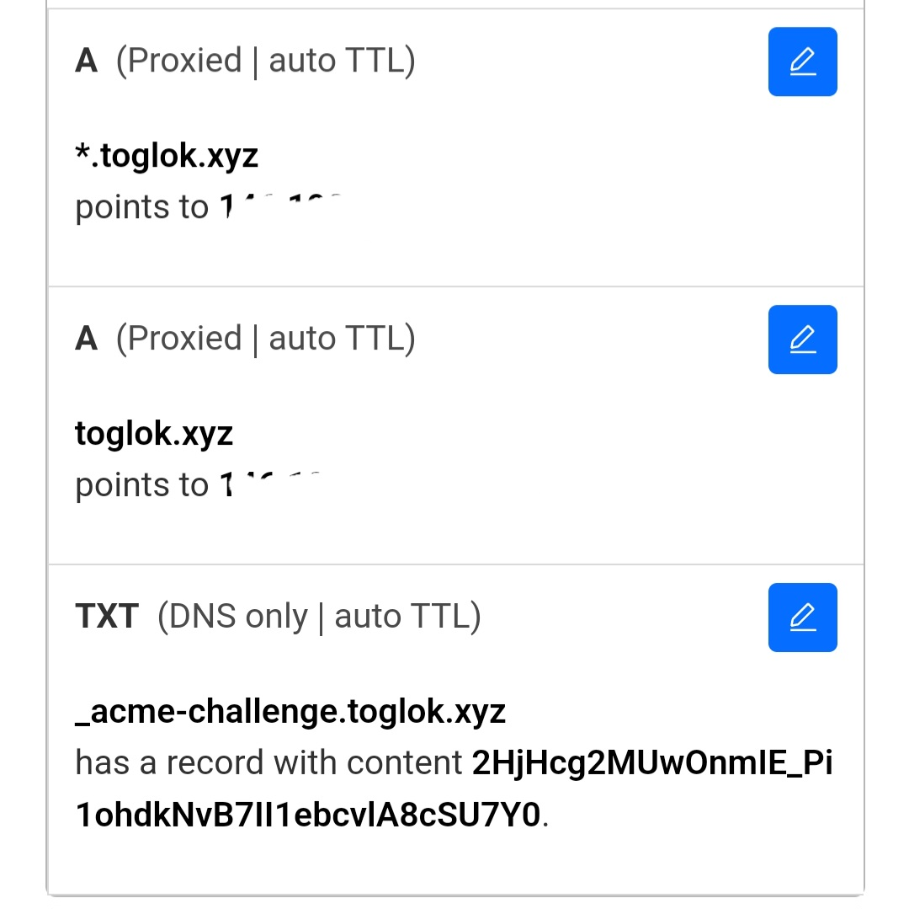
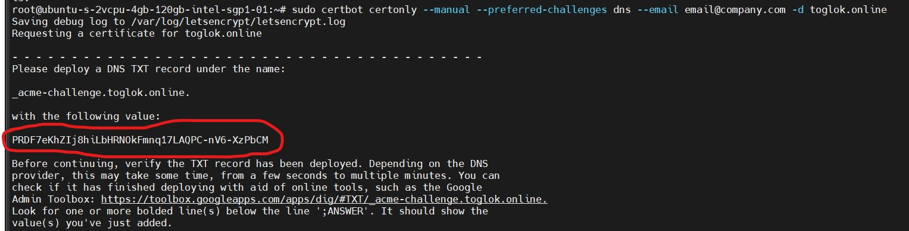

# ar.io-testnet-node

# Persiapan

> - Menginstal dan membuat wallet pada [ArConnect](https://chrome.google.com/webstore/detail/arconnect/einnioafmpimabjcddiinlhmijaionap)
> - Isi wallet teman-teman minimal 0.02 AR yang bisa teman-teman deposit dari Binance
> - Membeli domain TOP LEVEL contohnya .com/.dev/.xyz **(JANGAN MENGGUNAKAN DOMAIN MY.ID KARENA SISTEM AKAN MENDETEKSI BAHWA ANDA HANYA MENGGUNAKAN SUBDOMAIN)**

# Instalasi Package

```bash
sudo apt update && sudo apt upgrade -y && sudo apt-get update && sudo apt install jq git certbot nginx sqlite3 build-essential -y && sudo apt install apt-transport-https ca-certificates curl software-properties-common -y && curl -fsSL https://download.docker.com/linux/ubuntu/gpg | sudo apt-key add - && sudo add-apt-repository "deb [arch=amd64] https://download.docker.com/linux/ubuntu focal stable" && sudo apt-get install docker-ce docker-ce-cli containerd.io docker-compose-plugin -y && curl -o- https://raw.githubusercontent.com/nvm-sh/nvm/v0.39.0/install.sh | bash && source ~/.bashrc && nvm install 16.15.1 && nvm use 16.15.1 && curl -sSL https://dl.yarnpkg.com/debian/pubkey.gpg | sudo apt-key add - && echo "deb https://dl.yarnpkg.com/debian/ stable main" | sudo tee /etc/apt/sources.list.d/yarn.list && sudo apt-get update -y && sudo apt-get install yarn -y git clone https://github.com/ar-io/ar-io-node.git
```

# Mengatur Domain

a. Setelah anda membeli domain tadi saya sarankan anda menyambungkanya ke [Cloudflare](https://dash.cloudflare.com/) dengan cara name servernya yang di ubah
{width=400 height=300}
b. Jika domain anda sudah di set ke Cloudflare maka anda harus membuat DNS seperti gambar berikut ini :

- Buat DNS dengan TYPE A DAN NAME NYA \* LALU VALUE(CONTENT) BERISI IP ADDRES VPS TEMAN-TEMAN
- Buat LAGI DNS dengan TYPE A DAN NAME NYA @ LALU VALUE(CONTENT) BERISI IP ADDRES VPS TEMAN-TEMAN
  c. Membuat DNS TYPE TXT dengan cara copy command di bawah ini dan ganti dengan domain yang kalian miliki misal domain.com rubah menjadi alfonova.online

```bash
sudo certbot certonly --manual --preferred-challenges dns --email email@company.com -d domain.com
```

- Maka akan muncul seperti gambar berikut :  
  

**TOLONG JANGAN LANGSUNG DI ENTER JIKA MUNCUL SEPERTI INI UBAH DULU DATANYA SEPERTI GAMBAR DNS TXT**

- Pergi ke Cloudflare lagi dan membuat DNS baru dengan `TYPE TXT`

- Name isi dengan yang di berikan di vps contoh `_acme-challenge.toglok.online.` saya mengisi nya di name sedangkan content nya berisi `PRDF7eKhZIj8hiLbHRNOkFmnq17LAQPC-nV6-XzPbCM`

# Mendownload File Node

Copy command di bawah ini lalu tunggu sampai download telah selesai jika sudah selesai teman-teman buka folder yang telah kita download tadi

```bash
git clone https://github.com/ar-io/ar-io-node.git
cd ~/ar-io-node
```

# Menyiapkan Nginx

a. Pertama Hapus dulu page default nya dengan code sebagai berikut :

```bash
rm /etc/nginx/sites-available/default
```

b. Selanjutnya membuat file baru dan mengisi file tersebut

```bash
nano /etc/nginx/sites-available/default
```

c. Selanjutnya mengisi file dengan script sebagai berikut :

```nginx
server {
    listen 80;
    listen [::]:80;
    server_name  domain.com *.domain.com;

    location / {
        return 301 https://$host$request_uri;
    }
}

server {
    listen 443 ssl;
    listen [::]:443 ssl;
    server_name domain.com *.domain.com;

    ssl_certificate /etc/letsencrypt/live/domain.com/fullchain.pem;
    ssl_certificate_key /etc/letsencrypt/live/domain.com/privkey.pem;

    location / {
        proxy_pass http://localhost:3000;
        proxy_set_header Host $host;
        proxy_set_header X-Real-IP $remote_addr;
        proxy_set_header X-Forwarded-For $proxy_add_x_forwarded_for;
        proxy_http

_version 1.1;
    }
}
```

domain.com ubah menjadi domain anda

d. Restart Nginx

```bash
sudo service nginx restart
sudo nginx -t
```

# Mengatur .env

- Buka notepad lalu ubah data ini sesuai data anda:
- AR_IO_WALLET= ADDRES WALLET YANG TELAH KITA BUAT DI LANGKAH PERTAMA
- ARNS_ROOT_HOST = domain yang telah kita setting tadi

```bash
AR_IO_WALLET=
GRAPHQL_HOST=arweave.net
GRAPHQL_PORT=443
START_HEIGHT=1000000
ARNS_ROOT_HOST=alfonova.app
```

- Jika sudah mengubah data di atas buka vps kembali lalu copy command berikut jika sudah jangan lupa tekan `CTRL+X` lalu `Y` lalu `ENTER` untuk keluar

```bash
cd ~/ar-io-node
nano .env
```

# Menjalankan Node

a. Copy command berikut lalu tunggu hingga proses instalasi berjalan hingga selesai

```bash
sudo docker compose up -d --build
```

# Mengambil Faucet

a. Pergi ke discord [di sini](https://discord.gg/3yydrDCz) lalu masuk ke channel #testnet
b. Paste domain kamu https://domain.com/ar-io/info

a. Export Wallet dengan cara masuk ke wallet yang telah di buat tadi lalu pergi ke pengaturan lalu pilih wallets lalu pilih `EXPORT WALLETS` jangan lupa ubah nama filenya menjadi `key.json`


# Instal Contract

```bash
cd
git clone https://github.com/ar-io/testnet-contract.git
cd ~/testnet-contract
yarn install
yarn build
```

- Setelah selesai menginstall anda harus memindahkan wallet yang telah di import tadi ke folder `testnet-contract`

# Menambahkan Identity

a. Copy command berikut

```bash
nano tools/join-network.ts
```


- Ubah qty dari 100_000 Menjadi 10_000
- Const label dari Parmagate menjadi Nickname andalan kamu
- Const fqdn dari Parmagate.io menjadi domain yang kamu buat tadi
- Const note dari Owned and operated by DTF. menjadi suka-suka kamu

# STAKE

Copy command ini agar faucet yang di berikan akan di stake

```bash
yarn ts-node tools/join-network.ts
```

```

Gantilah `domain.com` dengan domain yang Anda miliki di seluruh file README.md. Setelah Anda mengganti semua nilai yang sesuai, Anda dapat menyimpan file ini sebagai `README.md` di repositori GitHub Anda. Jika Anda ingin menambahkan lebih banyak konten atau mengatur tata letak dengan lebih baik, Anda dapat memahami sintaksis Markdown yang digunakan dalam file ini.

Setelah menyimpan file README.md, unggahnya ke repositori GitHub Anda. Pastikan file ini berada di root direktori repositori Anda. Setelah itu, ketika seseorang mengunjungi repositori GitHub Anda, README.md akan ditampilkan sebagai panduan atau dokumentasi untuk proyek Anda.
```
