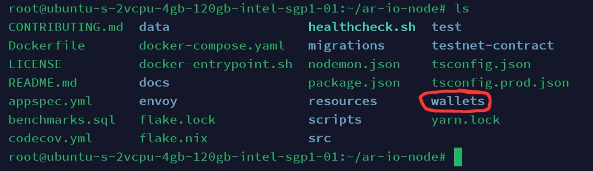

## Update node

* masuk ke direktori node
```
cd node-ar-io
```
* tarik perubahan terbaru
```
git pull
```
* matikan docker
```
sudo docker-compose down -v
```
* pangkas docker

*ini opsioanl tapi lebih baik lakukan*
```
sudo docker system prune
```
* run kembali docker

*buat kembali container Docker untuk mengimplementasikan perubahan*
```
sudo docker-compose up -d --build
```
* simpan key anda di direktori wallets


