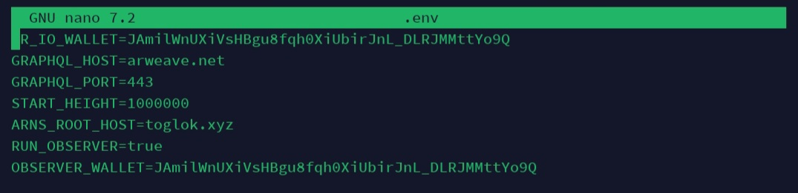
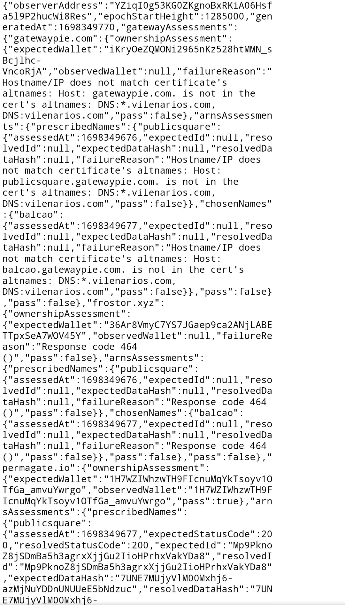

## Update node

* masuk ke direktori node
```
cd node-ar-io
```
* tarik perubahan terbaru
```
git pull
```
* matikan docker
```
sudo docker-compose down -v
```
* pangkas docker

*ini opsioanl tapi lebih baik lakukan*
```
sudo docker system prune
```
* run kembali docker

*buat kembali container Docker untuk mengimplementasikan perubahan*
```
sudo docker-compose up -d --build
```
* simpan key anda di direktori wallets


*ganti nama wallet dengan nama `<public address>.json`*

misalnya : `JAmilWnUXiVsHBgu8fqh0XiUbirJnL_DLRJMMttYo9Q.json`

* tambahkan OBSERVER dan OBSERVER wallet di `.env` file

**edit file `.env`**
```
nano .env
```

**tambahkan ini ke dalam file `.env`**
```
RUN_OBSERVER=true
OBSERVER_WALLET=<isi dengan addres kamu>
```

kalo sudah `ctrl+x` `y` `enter`

* matikan docker
```
sudo docker-compose down -v
```
* mulai ulang docker 
```
sudo docker-compose up -d --build
```
###selesai

buka ```ttps://<domainkamu>/ar-io/observer/reports/current```

contoh `https://toglok.xyz/ar-io/observer/reports/current`

**jika masih pending tunggu sebentar**

**kalo sudah akan tampil seperti ini**


#### selamat node sudah terupgrade


